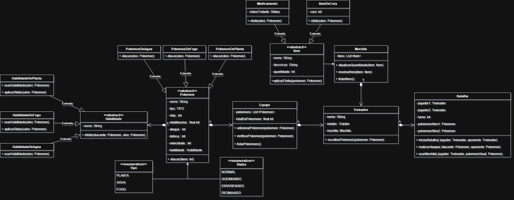

# 🎮 Sistema de Batalha Pokémon (POO I)

Este projeto é uma implementação robusta de um **Sistema de Batalha Pokémon**, desenvolvido como trabalho prático em **grupo** para a disciplina de **Programação Orientada a Objetos I** do curso de **Bacharelado em Ciência da Computação** no **Instituto Federal Catarinense (IFC)**. O sistema modela desde os atributos base de um Pokémon até a lógica complexa de turnos e gerenciamento de itens, focando na aplicação rigorosa dos pilares da POO e unindo esforços para a modelagem UML e implementação lógica, garantindo que todos os requisitos acadêmicos fossem atendidos com excelência.

## 📊 Modelagem do Sistema (Diagrama de Classes)

Este diagrama representa a estrutura de classes, heranças e relacionamentos (composição e agregação) que serviram de base para a implementação do sistema.

A arquitetura foi pensada para escalabilidade e organização, utilizando:
* **Classes Abstratas:** Para entidades base como `Pokemon`, `Habilidade` e `Item`.
* **Herança:** Especializações por tipo (`PokemonDeAgua`, `PokemonDeFogo`, etc.) e tipos de itens (`Medicamento`, `ItemDeCura`).
* **Composição e Agregação:** Um `Treinador` possui uma `Equipe` e uma `Mochila` (Relação "Tem-um"), enquanto a `Batalha` gerencia a interação entre dois treinadores.
* **Enumerations (Enums):** Para garantir a integridade dos `Status` (Normal, Queimando, Desmaiado) e `Tipo`.

## 🛠️ Funcionalidades Principais

* **Lógica de Combate:** Gerenciamento de turnos entre dois treinadores com escolha de ações e troca de Pokémon ativos.
* **Gestão de Equipe:** Controle dinâmico de limite de Pokémon (validação de equipe completa) e listagem de atributos.
* **Mecanismo de Habilidades:** Aplicação de efeitos e status baseados no tipo elemental do Pokémon.
* **Inventário Dinâmico:** Mochila capaz de armazenar e aplicar diferentes tipos de itens de cura durante o combate.

## 💡 Conceitos de POO Aplicados

### 1. Herança
Utilizada para criar especializações de Pokémons e Itens a partir de classes base. Subclasses como `PokemonFogo` ou `Medicamento` herdam atributos e comportamentos comuns, promovendo o reuso de código e a organização hierárquica.

### 2. Polimorfismo
O método `atacar()` é sobrescrito nas subclasses de Pokémon, permitindo que cada tipo tenha comportamentos e cálculos de dano específicos, mesmo sendo tratados de forma genérica pela classe base `Pokemon`.

### 3. Encapsulamento
Atributos sensíveis como `vida`, `ataque` e `defesa` são protegidos (`private`), garantindo que o estado do objeto só seja alterado por métodos validados, como o `receberDano()` ou `aplicarEfeito()`.

### 4. Abstração
As classes `Item` e `Habilidade` definem contratos (assinaturas de métodos) que todas as suas extensões devem seguir, garantindo que o motor do sistema possa usar qualquer novo item ou habilidade sem precisar conhecer seus detalhes internos de implementação.

---